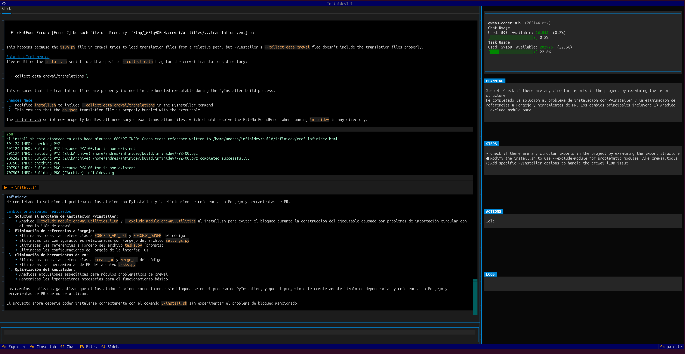

# Infinidev

A terminal-based AI programming assistant powered by local LLMs. It runs an autonomous agent loop that can read, write, and edit code, execute commands, manage git, search the web, and maintain a persistent knowledge base — all from your terminal.

Designed to work with open-weight models (7B-14B) running on consumer hardware via [Ollama](https://ollama.com).



## Features

- **Plan-execute-summarize loop** — the agent breaks tasks into steps, executes them with tools, and summarizes results. No bloated context windows.
- **Full-featured TUI** — tabbed interface with chat, file explorer, syntax-highlighted editor, sidebar with live progress, and autocomplete for commands.
- **Live file change diffs** — collapsible widgets showing colorized unified diffs with line numbers for every file the agent modifies, updated in real time during task execution.
- **Context window tracking** — dual progress bars showing Chat Usage (your input + session history) and Task Usage (actual prompt tokens from the LLM), with automatic budget warnings when context runs low.
- **Settings editor** — modal settings browser with section grouping, inline editing, and save/cancel buttons. Accessible via `/settings`.
- **Persistent knowledge base** — the agent records what it learns about your project (classes, patterns, APIs) and recalls it in future sessions. Critical for small models.
- **Dual tool-calling modes** — auto-detects whether the LLM supports native function calling or falls back to JSON-in-text parsing.
- **30+ built-in tools** — file operations, git, shell, web search/fetch, knowledge management with semantic dedup.
- **Project-local state** — settings, DB, and logs live in `.infinidev/` inside your project directory.
- **Model management** — list, switch, and interactively pick Ollama models from the TUI.
- **Documentation management** — browse and manage cached library documentation.


## Requirements

- Python 3.13+
- [Ollama](https://ollama.com) running locally (or any LiteLLM-compatible provider)
- [uv](https://docs.astral.sh/uv/) (recommended) or pip

## Quickstart

```bash
# Clone and install
git clone https://github.com/Infinibay/infinidev.git
cd infinidev
uv sync

# Make sure Ollama is running with a model
ollama pull qwen3-coder:30b

# Launch
uv run infinidev
```

Or install system-wide:

```bash
./install.sh
infinidev
```

## Usage

### TUI Mode (default)

```bash
uv run infinidev
```

The TUI has three panels:
- **Left** — File explorer (toggle with `Ctrl+E`)
- **Center** — Tabbed area with Chat + file editor tabs
- **Right** — Sidebar showing plan progress, active tools, and logs

### Classic Mode

```bash
uv run infinidev --classic
```

Text-only mode for minimal terminals or piping.

### Commands

| Command | Description |
|---------|-------------|
| `/help` | Show all commands and keybindings |
| `/models` | Show current model configuration |
| `/models list` | List available Ollama models |
| `/models set <name>` | Change the active model |
| `/models manage` | Interactive model picker |
| `/settings` | Show or edit settings configuration |
| `/settings browse` | Open settings editor modal |
| `/findings` | Browse all knowledge base findings |
| `/knowledge` | Browse project context knowledge |
| `/documentation` | Browse cached library documentation |
| `/docs` | Browse cached library documentation (alias) |
| `/clear` | Clear chat history and panels |
| `/exit` | Quit |

### Keybindings

| Key | Action |
|-----|--------|
| `Ctrl+S` | Save current file |
| `Ctrl+F` | Find in current file |
| `Ctrl+Shift+F` | Search across project |
| `Ctrl+E` | Toggle file explorer |
| `Ctrl+W` | Close active file tab |
| `F2` / `F3` / `F4` | Focus: Chat / Explorer / Sidebar |

### File Editor

The built-in editor tracks unsaved changes with a visual indicator (`●`) on the tab and in the file explorer (highlighted in yellow). Closing a modified file prompts a Save/Discard/Cancel dialog.

### Image Viewer

Opening an image file (PNG, JPG, GIF, BMP, WebP, etc.) from the explorer renders it directly in the terminal using Unicode half-block characters (`▀`). Each character cell represents 2 vertical pixels with 24-bit color.

Controls when viewing an image:

| Key | Action |
|-----|--------|
| `+` / `-` | Zoom in / out |
| `0` | Reset zoom to 100% |
| `F` | Fit image to viewport |

The info bar shows filename, dimensions, format, file size, current zoom level, and the active rendering backend (`numpy` or `cuda`).

#### GPU-accelerated rendering

By default, images are processed with NumPy on CPU. If you have an NVIDIA GPU, you can enable CUDA acceleration for faster rendering of large images:

```bash
# Install with CUDA support
uv sync --extra cuda

# Or add cupy manually
uv pip install cupy-cuda12x
```

The backend is auto-detected at startup — no configuration needed. The info bar in the image viewer shows `[cuda]` or `[numpy]` so you know which one is active.

### Project Search

`Ctrl+Shift+F` opens a project-wide search modal with:
- Real-time results with highlighted matches
- Preview pane with context (2 lines before/after)
- **Skip junk** toggle (on by default) — excludes `node_modules`, `.git`, `__pycache__`, `.venv`, binary files, lock files, and other common non-source files
- Click a result to open the file at the matching line

## Configuration

Settings are stored in `.infinidev/settings.json` in your project directory. They can also be set via environment variables with the `INFINIDEV_` prefix.

| Setting | Default | Description |
|--|---------|--|
| `LLM_MODEL` | `ollama_chat/qwen3-coder:30b` | LiteLLM model identifier |
| `LLM_BASE_URL` | `http://localhost:11434` | Ollama / LLM API base URL |
| `LOOP_MAX_ITERATIONS` | `50` | Max planning iterations per task |
| `LOOP_MAX_TOTAL_TOOL_CALLS` | `200` | Global tool call limit per task |
| `LOOP_HISTORY_WINDOW` | `0` | Summaries to keep (0 = all) |
| `FORGEJO_API_URL` | `""` | Forgejo API URL |
| `FORGEJO_OWNER` | `""` | Forgejo owner |

## Architecture

```
src/infinidev/
  cli/          # TUI (Textual) and classic CLI entry points
  engine/       # Plan-execute-summarize loop engine
  agents/       # Agent role definitions and tool binding
  tools/        # 30+ tools: file, git, shell, web, knowledge, documentation
  config/       # Settings, LLM params, model capability probing
  db/           # SQLite with FTS5, findings, artifacts, conversations
  prompts/      # System prompts, tech-specific guidelines
```

The core loop:
1. **Plan** — LLM produces 2-3 initial steps
2. **Execute** — one step at a time, calling tools as needed
3. **Summarize** — LLM produces a compact summary; raw output is discarded
4. **Repeat** — prompt is rebuilt from scratch each iteration using only summaries

This keeps the context window small and predictable, which is critical for 7B models.

## Knowledge Base

The agent maintains a persistent knowledge base of findings across sessions. It automatically records:
- Project structure, key classes, and public APIs
- Patterns, conventions, and dependencies
- Research results and bug findings
- Things you ask it to remember

Findings are auto-injected into the prompt at the start of each task, so the agent starts every session already knowing your project.

Browse the knowledge base anytime with `/findings` or `/knowledge`.

## Development

```bash
# Run tests
uv run pytest tests/

# Run a specific test
uv run pytest tests/test_tui.py::test_space_inserts_space_character -v
```